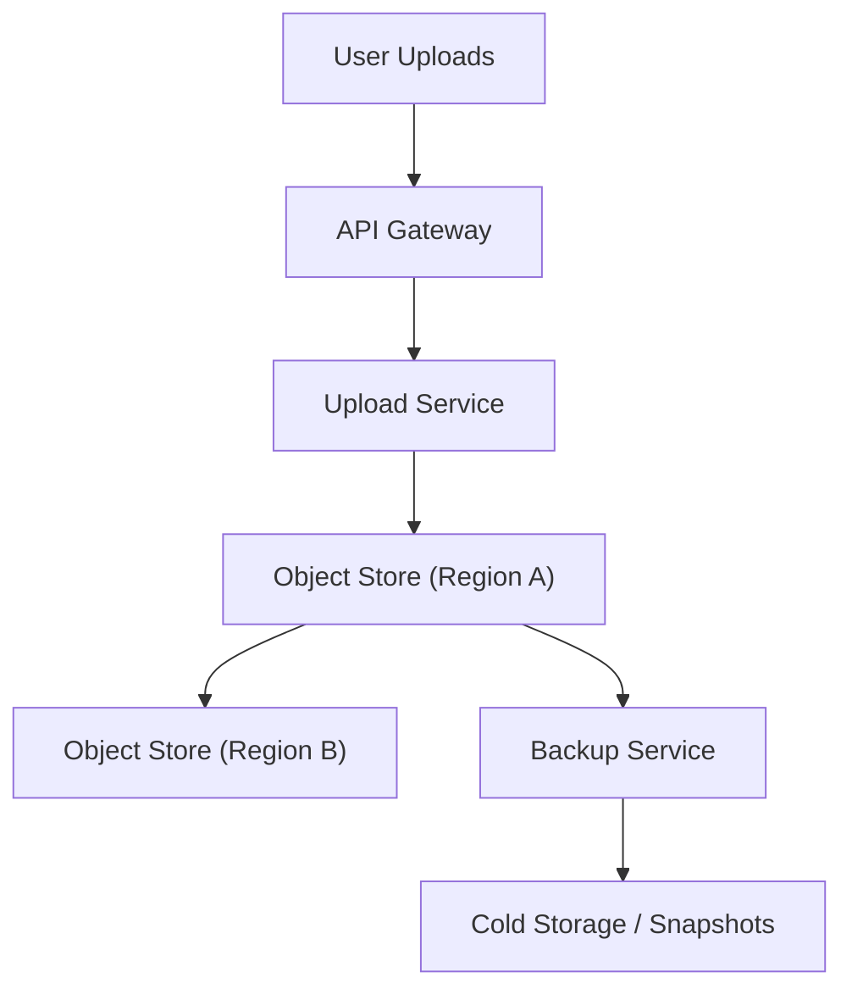
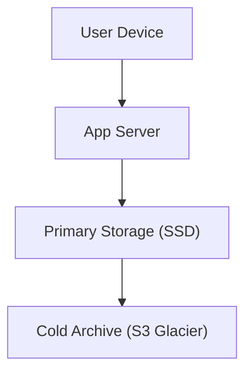
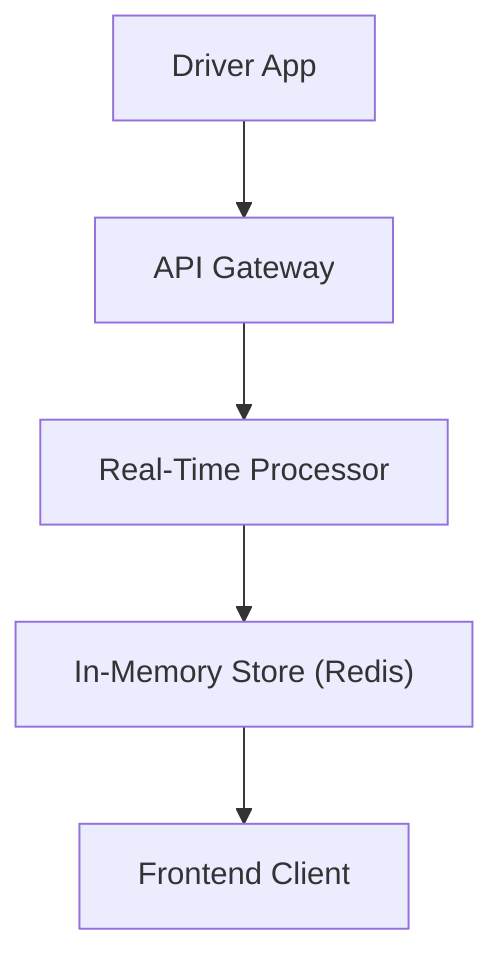

## 📊 Breakdown by Durability Levels
### 🔒 High Durability
#### ✅ Definition:
Data must never be lost, under almost any failure scenario.

#### 💡 Real-World Examples:
+ **User photos/videos** on Google Photos, iCloud
+ **Bank transactions** or **payment records**
+ **Medical records**
+ **Legal contracts** or **tax documents**
+ **Blockchain transactions**

#### 🏗️ Design Techniques:
+ **Replicated storage** across data centers (geo-redundancy)
+ **RAID** + **checksums** + **auto-healing**
+ Use of **Write-Ahead Logs (WAL)** or **journaling file systems**
+ **Backups** and **snapshots**
+ **Event sourcing** and immutability for critical logs

#### High Durability Example – User Photos Backup (e.g., Google Photos)

##### Architecture:
+ User uploads go through an API Gateway and Upload Service.
+ Data is stored in Object Store A, and replicated to Object Store B in another region.
+ A Backup Service also sends data to cold storage or snapshot/archive layers.

##### Key Features:
+ Cross-region replication
+ Backup system
+ No single point of failure

##### High-Level Architecture:

#### High Durability (User Photos)
##### Use Case: Users’ irreplaceable memories—photos and videos—must survive any failure.

| Key Feature                    | Why It Matters                                               |
| ------------------------------ | ------------------------------------------------------------ |
| **Cross‑region replication**   | Protects against data‑center or regional outages. If Region A goes offline (natural disaster, network partition, etc.), Region B still has a complete copy. |
| **Backup system**              | Guards against software bugs, accidental deletes, or silent data corruption. Regular snapshots let you roll back to a known good state. |
| **No single point of failure** | Every component (API gateway, storage node, network link) is duplicated or clustered. A failure in one node won’t cause any data loss or unavailability. |

> **Result:** Even under multiple concurrent failures—hardware, software, or operational—user photos remain intact and accessible.

#### 🎯 In interviews:

Say something like: “For life memories like photos, we cannot afford correlated data center failures. I would store them in a distributed object store like Amazon S3 with cross-region replication and lifecycle backups.”

### 🟡 Medium Durability
#### ✅ Definition:
Losing some old data is tolerable, but should still be minimized.

#### 💡 Real-World Examples:
+ **Chat history** in social messaging apps
+ **Old notifications**
+ **Archived logs or comments**

#### 🏗️ Design Techniques:
+ Use of **eventual persistence** (data may first land in-memory or cache before being flushed)
+ **Asynchronous backups**
+ **Cold storage** with lower redundancy
+ Store in **cheaper but less durable media** (e.g., spinning disks, object storage with fewer replicas)

#### Medium Durability Example – Chat Message Storage
##### Architecture:
+ App server receives messages and writes to **primary SSD storage**.
+ Periodically or asynchronously, older data is offloaded to *cold storage* (like AWS Glacier).

##### Key Features:
+ Performance for recent data
+ Lower-cost durability for old data
+ Acceptable to lose rarely accessed messages

##### High-Level Architecture:

#### Medium Durability (Chat History)

**Use Case:** Conversational history is important but generally forgivable if very old messages are lost.

| Key Feature                                        | Why It Matters                                               |
| -------------------------------------------------- | ------------------------------------------------------------ |
| **Performance focus on recent data**               | Recent messages must load instantly for a smooth chat experience. Keeping them on fast SSDs or in a cache minimizes latency. |
| **Asynchronous cold‑archive for old data**         | Offloading stale messages to cheaper, slower storage (e.g., Glacier) reins in costs without affecting day‑to‑day UX. |
| **Lower-cost durability for rarely accessed data** | You still store old chats, but with fewer replicas or on lower‑durability media—trading a tiny risk of loss for significantly lower storage bills. |

> **Result:** Users enjoy snappy access to recent chats, while the system manages costs and complexity by relaxing guarantees on decade‑old conversations they’re unlikely to revisit.

#### 🎯 In interviews:

Say: “We’ll ensure recent chat messages are stored with high redundancy, but older messages can move to cold storage. Occasional loss of decade-old chats likely won’t impact users.”

### 🔓 Low Durability
#### ✅ Definition:
Temporary or minor data loss is acceptable — the system can reconstruct or recover quickly.

#### 💡 Real-World Examples:
+ **Real-time GPS tracking** in ride-hailing (Uber, Grab)
+ **System logs** that aren't critical
+ **Telemetry data** from sensors
+ **A/B testing metrics** or ad impressions

#### 🏗️ Design Techniques:
+ **In-memory processing** with no guarantees of persistence (e.g., Redis without persistence)
+ Use **ephemeral queues** like Kafka with short retention
+ **Fire-and-forget** messaging patterns

### Low Durability Example – Driver Location in Real-Time App (e.g., Uber)
#### Architecture:
+ Driver pings location to API Gateway.
+ Real-time processor pushes updates into **in-memory cache (Redis)**.
+ Client apps read live data directly from cache.

#### Key Features:
+ Fast, low-latency updates
+ No disk write guarantees
+ Stale/missing data quickly replaced with next update

#### High-Level Architecture:

## Low Durability (Real‑Time Driver Locations)

**Use Case:** Continuous position updates where each new ping supersedes the last.

| Key Feature                             | Why It Matters                                               |
| --------------------------------------- | ------------------------------------------------------------ |
| **Fast, low‑latency updates**           | In‑memory stores (e.g., Redis) and ephemeral pipelines ensure the driver’s map pin moves in near‑real time. |
| **No disk‑write guarantees**            | Skipping durable writes cuts both latency and I/O pressure—critical when you’re receiving tens or hundreds of updates per second. |
| **Stale/missing data quickly replaced** | Even if one update is dropped, the very next ping (in seconds) corrects the state. The system tolerates those brief gaps. |

> **Result:** Riders and dispatchers see an up‑to‑date map with minimal lag. Occasional dropped points are harmless because fresh location data arrives almost immediately.

#### 🎯 In interviews:

Say: “Driver location updates can afford to lose a few data points since we’ll receive fresh ones within seconds. Prioritizing low-latency over persistence makes sense here.”

#### 🚦 Summary Table
| **Durability Level** | **Example**                      | **Design Focus**                  | **Data Loss Impact**           |
| -------------------- | -------------------------------- | --------------------------------- | ------------------------------ |
| **High**             | Photos, banking, medical records | Cross-region replication, backups | Critical — never acceptable    |
| **Medium**           | Chat logs, notifications         | Eventual writes, cold storage     | Acceptable for old data        |
| **Low**              | GPS pings, telemetry, logs       | In-memory or ephemeral processing | Tolerable, quickly recoverable |

**In summary**, the level of durability you architect should reflect:

1. **User impact:** How angry or inconvenienced would they be if data is lost?
2. **Cost & complexity:** Higher durability requires more infrastructure, operational effort, and expense.
3. **Data lifecycle:** Freshness and criticality often correlate—ephemeral data can tolerate low durability, while precious archives demand rock‑solid persistence.

Choosing the right combination of features ensures you meet user expectations without overbuilding or overspending.
