# **Designing Globally Distributed Systems for High Scale and High QPS**

## **I. Introduction**

Designing systems capable of serving a massive, globally distributed user base while handling extremely high query volumes (Queries Per Second, QPS) presents significant engineering challenges. This document outlines the core concepts, design criteria, architectural patterns, and critical trade-offs involved in building such systems, framed within the context of a system design discussion for senior engineers. Successfully architecting these systems requires moving beyond simple application development towards a deep understanding of distributed computing principles. The complexity arises not just from the sheer volume of users and requests but also from the need to maintain performance, availability, and consistency across geographically dispersed infrastructure.

This exploration will follow a layered approach, starting with plain English explanations, moving to illustrative analogies, and culminating in a technically detailed discussion. Key areas covered include fundamental scaling techniques, data management strategies, latency reduction methods, resilience patterns, non-functional requirements (NFRs) that shape the architecture, and the inherent trade-offs that must be navigated. The goal is to provide a structured framework for thinking about and discussing the design of large-scale systems, emphasizing the justification of choices based on requirements and constraints, a critical skill assessed in system design interviews.

## **II. Understanding the Core Problem: Scale, Global Users, High QPS**

Before designing a solution, it is essential to clearly define the problem's scope and inherent challenges. "Scale" in this context refers to handling a large number of concurrent users, processing vast amounts of data, and managing a high rate of requests.

**Defining Scale and QPS:**

A key metric for scale is Queries Per Second (QPS), which specifically measures the number of database queries executed per second. [^1] This is distinct from Requests Per Second (RPS), which counts all incoming requests to a server (including static assets, API calls, etc.). [^1] While often used interchangeably, focusing on QPS is critical because the database frequently represents the most significant bottleneck in scalable systems due to its stateful nature. [^1] Engineers monitor QPS closely to prevent database overload.[^1] Understanding the expected QPS is vital for capacity planning and architectural choices.[^2] Systems can be categorized by their QPS load [^1]:

- **Medium QPS (100-1,000 QPS):** Typical for growing SaaS applications or popular blogs. Monolithic architectures may start facing database bottlenecks.[^1]
- **High QPS (1,000-100,000 QPS):** Common for large e-commerce sites, popular SaaS products, or social media platforms. Requires scalable, resilient architectures like microservices, caching, and distributed data stores.[^1]
- **Very High QPS (100,000+ QPS):** Seen in global-scale platforms like major social networks or financial trading systems. Demands extremely robust, globally distributed, fault-tolerant designs.[^1] Some events, like Amazon Prime Day, might push QPS into the millions, requiring sophisticated queuing and processing infrastructure.[^3]

**Challenges of Global Distribution & High Concurrency:**

Operating at a global scale with high QPS introduces several fundamental challenges:

- **Latency:** The physical distance between servers and users across the globe introduces significant network latency, impacting user experience.[^4] Minimizing this delay is crucial, especially for interactive applications.[^4]
- **Concurrency:** A large active user base translates to high concurrency – many users accessing the system simultaneously.[^7] While high concurrency is necessary to achieve high QPS, it doesn't guarantee it; the system must also process each request quickly.[^8]
- **Data Volume & Movement:** Global user activity generates enormous datasets ("big data") that often exceed the capacity of a single machine.[^7] This necessitates distributed storage solutions and efficient strategies for moving data between locations (e.g., for replication or analysis).[^9]
- **Load Variability & Spikes:** User traffic is rarely uniform. Systems must cope with predictable patterns (like diurnal cycles) and unpredictable surges (like flash sales or viral events, sometimes called the "thundering herd").[^2] Designing only for average load leads to failure during peak times.[^4]
- **Fault Tolerance:** In large, distributed systems, component failures (servers, networks, disks) are not exceptions but expected occurrences.[^2] The system must be designed to tolerate these failures gracefully without significant downtime or data loss.[^2]
- **Consistency:** Ensuring that all users see a consistent view of data, especially when it's replicated across multiple geographic locations, is a complex challenge.[^4] Updates must be propagated, and conflicts resolved.[^4]
- **Operational Complexity:** Deploying, monitoring, debugging, and maintaining a globally distributed system with numerous components is significantly more complex than managing a single application.[^11] Effective automation, monitoring, and observability are essential, and monitoring itself can become a large-scale data problem.[^11]

The difficulty of handling high QPS is not solely determined by the number of queries but also significantly by the complexity of those queries.[^8] A system handling 100,000 simple key-value lookups per second faces different challenges than one handling 100,000 complex analytical queries involving joins and aggregations over large datasets.[^8] The latter often requires specialized database engines (e.g., columnar stores, OLAP databases) and architectural patterns (like pre-computation or data warehousing techniques) that are unsuitable for typical online transaction processing (OLTP) workloads.[^8] Misunderstanding the nature of the queries can lead to poor technology choices and inadequate performance scaling.[^8]

Furthermore, achieving high throughput (QPS) requires addressing both concurrency and latency.[^8] While horizontal scaling (adding more servers) increases the system's capacity to handle concurrent requests, it doesn't inherently reduce the time taken to process each individual request.[^13] If individual queries are slow, simply adding more servers will yield diminishing returns and won't achieve the desired QPS target.[^8] Optimizing the performance of individual queries (reducing latency) through techniques like indexing, caching, and efficient data modeling is equally, if not more, critical than just scaling the infrastructure for concurrency.[^8]

Ultimately, the transition from small or medium-scale systems to large, global, high-QPS systems represents a fundamental shift in design philosophy.[^7] Techniques effective at lower scales, such as vertical scaling or relying on a single relational database, often prove insufficient.[^9] The dominant challenges become those inherent to distributed systems: managing network latency, ensuring data consistency across replicas, partitioning data effectively, handling partial failures gracefully, and coordinating actions across multiple machines.[^7] Architectural patterns like microservices, distributed databases, asynchronous communication, and aggressive caching become necessary not just for performance but for resilience, manageability, and the ability to evolve the system over time.[^1]

## **III. Designing for Scale: A Layered Explanation**

To approach the design of such a system systematically, we can use a layered explanation, starting with basic concepts and progressively adding technical detail.

### **3.1. Level 1: Plain English**

Handling millions of users worldwide and a constant flood of requests requires a different approach than running a small website on a single computer. The core idea is to avoid bottlenecks and single points of failure by distributing the work and data.

- **Distribution:** Instead of one powerful server trying to do everything, use many smaller, standard servers working together.[^13] When requests come in, something directs them to a server that isn't too busy.[^13] If one server fails, others are available to pick up the slack.[^13] Think of it like having multiple checkout lanes at a supermarket instead of just one.
- **Replication:** Don't keep important information in just one place. Make copies and store them in different locations.[^13] This achieves two things: users can access data from a nearby copy, which is faster, and if one location has a problem (like a power outage), the data is still safe elsewhere.[^13] It's like libraries keeping copies of popular books in multiple branches.
- **Specialization:** Break the system down into smaller parts, each responsible for a specific job (like handling user logins, processing orders, or managing product catalogs).[^13] This makes it easier to update or scale specific parts independently if they become very busy, similar to how a large company has specialized departments.
- **Proximity:** To make things faster for users around the world, place servers and copies of data geographically closer to them.[^13] This reduces the time it takes for requests and responses to travel across the network, like having warehouses closer to customers for faster deliveries.[^13]

### **3.2. Level 2: Analogy (Global Fast-Food Chain)**

Imagine designing the operations for a massive, global fast-food chain aiming for quick service (low latency) and handling huge customer volumes (high QPS/RPS) worldwide.

- **Single Restaurant (Small Scale):** A single restaurant with one kitchen and manager works for a small town. But during lunch rush (peak load), it gets overwhelmed. Customers far away face a long drive (high latency).
- **Scaling Up (Vertical Scaling):** You could build a bigger kitchen and hire more staff in that *same* restaurant.[^9] This helps handle more local customers but has physical limits, becomes complex to manage, and if this one location closes (server failure), everyone nearby goes hungry.[^9]
- **Scaling Out (Horizontal Scaling):** A better approach is to open multiple identical restaurants (servers) across the city.[^13] You need a central dispatch system (Load Balancer) to send customers to the nearest or least busy restaurant.[^13] For this to work efficiently, each restaurant must be able to serve any customer using the same standard recipes and procedures (stateless services).[^13]
- **Global Expansion (Distribution):** To serve the world, open restaurants in different cities and countries (multiple data centers/regions).[^9] A global positioning system directs customers to their nearest outlet (Geo-routing).[^9] Standardized items like posters or logos (static assets) are sourced from local distribution centers (Content Delivery Network - CDN) to ensure fast availability everywhere.[^13]
- **Supply Chain (Data Management):**

  - **Replication:** Every restaurant needs the standard menu (read replicas).[^13] New menu items or price changes (writes) are decided at HQ (master database) and distributed to all locations (replication).[^13] There might be a slight delay before a new item appears everywhere (eventual consistency).[^13]
  - **Sharding:** If the chain tracks every single customer order globally, storing all that data at HQ becomes unmanageable. Instead, order data might be stored at regional HQs (sharded databases).[^13] Generating a global sales report requires querying all regional HQs, which is more complex (cross-shard queries).[^13]

- **Reducing Wait Times (Latency & Performance):**

  - **Caching:** Keep popular, pre-made items (like drinks or pre-wrapped burgers) right at the counter (in-memory cache) for instant service.[^13] This avoids waiting for the kitchen (database) for common requests.[^13]
  - **CDN (Revisited):** Standardized items (static assets) are stored locally (CDN edge servers), avoiding fetching them from HQ every time.[^13]

- **Efficient Kitchen Workflow (Resilience & Decoupling):**

  - **Async Processing/Queues:** Instead of the cashier waiting for the kitchen to make each item, orders (requests) are placed on a digital queue (message queue).[^13] The kitchen staff (worker services) pick up orders from the queue when they have capacity.[^13] This frees up the cashier immediately (improves responsiveness) and prevents the front counter from halting if the grill station (a specific service) is temporarily backed up.[^13]
  - **Microservices:** The kitchen is organized into specialized stations: drinks, grill, fries, assembly (microservices).[^13] If the drink machine breaks (a service fails), customers can still order food. If burgers become extremely popular, you can add more grill capacity (scale the specific service) without expanding the entire kitchen.[^1]

### **3.3. Level 3: Technical Depth**

Building upon the concepts and analogy, we now delve into the specific technologies and architectural patterns employed to achieve global scale, high QPS, and low latency.

#### **3.3.1. Horizontal Scaling (Handling Load)**

The primary strategy for handling large loads is horizontal scaling (scaling out), which involves adding more machines (servers, instances, nodes) to distribute the workload, as opposed to vertical scaling (scaling up) by increasing the resources of a single machine.[^13] Vertical scaling faces inherent hardware limits and lacks redundancy, making horizontal scaling preferable for large-scale, highly available applications.[^6]

- **Stateless Services:** A cornerstone of horizontal scaling is designing application tiers (web servers, API gateways) to be stateless.[^13] This means the server handling a request does not store any client-specific session data between requests. Any required state is externalized to a database, cache, or dedicated session store. Statelessness allows any server in the pool to handle any incoming request, simplifying load balancing and enabling seamless addition or removal of instances.[^13]
- **Load Balancing:** Load balancers are essential for distributing incoming traffic across the pool of stateless servers.[^13]

- *Types:* Load balancers operate at different network layers. Layer 4 (Transport Layer) balancers make routing decisions based on IP addresses and ports, offering high performance but limited context.[^13] Layer 7 (Application Layer) balancers can inspect application-level data (HTTP headers, cookies, URL paths), enabling more sophisticated routing logic (e.g., routing based on API endpoint, user type) and features like SSL termination and session persistence (sticky sessions), albeit with potentially higher overhead.[^13]
- *Strategies:* Common algorithms include Round Robin (distributing requests sequentially), Least Connections (sending requests to the server with fewest active connections), and IP Hash (directing requests from the same client IP to the same server, useful for maintaining session affinity without external stores).[^13]
- *Benefits:* Load balancers increase overall system capacity, provide redundancy by routing traffic away from unhealthy or failed servers, and help eliminate single points of failure.[^13]
- *Considerations:* The load balancer itself can become a performance bottleneck if not adequately provisioned.[^13] High availability for the load balancer tier is critical, often achieved using redundant pairs in active-passive or active-active configurations.[^13]

- **Auto-Scaling:** Cloud platforms provide auto-scaling capabilities, allowing the number of server instances to be automatically adjusted based on real-time metrics like CPU utilization, network traffic, or queue length.[^14] This ensures the system has sufficient capacity during peak loads while minimizing costs during quiet periods.[^4] Effective auto-scaling requires careful configuration of scaling policies and robust monitoring to react appropriately to load changes without excessive fluctuation.[^4]

#### **3.3.2. Managing State & Data (Database Scaling)**

While stateless application tiers are relatively easy to scale horizontally, the stateful nature of databases presents a greater challenge.[^1] The database layer is frequently the primary bottleneck, especially under high QPS.[^1] Several techniques are employed to scale databases:

- **Replication:** Creating copies (replicas) of the database allows distributing read load and provides redundancy.[^13]

- *Master-Slave Replication:* A single master database handles all write operations, which are then replicated to one or more read-only slave databases.[^13] Read queries can be directed to the slaves, significantly increasing read throughput.[^13] If the master fails, a slave can be promoted to become the new master (failover).[^13] The main trade-off is replication lag: slaves might be slightly behind the master, meaning reads from slaves might return stale data (eventual consistency).[^13] Synchronous replication avoids lag but impacts write performance. Failover might involve data loss if the master fails before writes are fully replicated to the promoted slave.[^13]
- *Master-Master Replication:* Multiple master nodes can handle both read and write operations, replicating changes to each other.[^13] This offers higher write availability but introduces significant complexity in handling write conflicts (when the same data is modified concurrently on different masters) and can increase write latency due to coordination overhead.[^13]

- **Sharding (Partitioning):** This involves dividing the database horizontally into smaller, independent databases called shards.[^13] Data is distributed across shards based on a partition key (e.g., user ID, geographic region, product category).[^13]

- *Benefits:* Sharding distributes both read and write load across multiple machines, allowing the system to handle much larger datasets and higher QPS than a single database could.[^13] Queries targeting a single shard can be very fast.[^13]
- *Challenges:* Choosing an appropriate shard key is crucial to ensure even data distribution and avoid "hotspots" (shards receiving disproportionately high traffic).[^13] Queries that need to access data across multiple shards become complex, potentially requiring aggregation at the application layer or via specialized query routers, which can be slow.[^13] Rebalancing data across shards as the dataset grows or access patterns change adds operational complexity.[^13]

- **SQL vs. NoSQL:** The choice of database technology profoundly impacts scalability and consistency.[^13]

- *SQL (Relational Databases - e.g., PostgreSQL, MySQL):* Traditionally offer strong consistency guarantees via ACID (Atomicity, Consistency, Isolation, Durability) transactions.[^15] They excel at handling structured data with complex relationships and queries.[^13] Scaling writes horizontally beyond master-slave replication can be challenging, although solutions like sharding middleware (e.g., Vitess) exist. SQL databases are often associated with CP (Consistency + Partition Tolerance) systems in the CAP theorem context.[^15]
- *NoSQL (Non-Relational Databases - e.g., Key-Value, Document, Wide-Column, Graph):* A broad category designed primarily for high scalability, performance, and flexibility in data models.[^13] They often relax strong consistency guarantees in favor of higher availability and partition tolerance (often adhering to BASE principles - Basically Available, Soft state, Eventually consistent).[^13] Different NoSQL types are optimized for different data models and access patterns (e.g., Key-Value stores like Redis for caching/session data, Document stores like MongoDB for semi-structured data, Wide-Column stores like Cassandra for high-write workloads, Graph databases like Neo4j for relationship-heavy data).[^13] NoSQL databases are frequently used in AP (Availability + Partition Tolerance) systems.[^15]
- *The Choice:* Selecting between SQL and NoSQL (or using both in a polyglot persistence approach) depends heavily on the specific application requirements: the structure of the data, the required level of consistency (see CAP theorem trade-offs), the dominant query patterns (reads vs. writes, query complexity), and the anticipated scale.[^13]

A comparison of common database scaling strategies highlights these differences:

| **Strategy**                | **Description**                                                                    | **Read Scalability** | **Write Scalability** | **Consistency Implications**                    | **Complexity** | **Typical Use Cases**                                |
| --------------------------- | ---------------------------------------------------------------------------------- | -------------------- | --------------------- | ----------------------------------------------- | -------------- | ---------------------------------------------------- |
| **Replication (M-S)**       | Master handles writes, replicates to read-only Slaves. [^13]                       | High                 | Limited (Master)      | Eventual (default), potential stale read. [^13] | Moderate       | Read-heavy workloads, basic failover                 |
| **Replication (M-M)**       | Multiple Masters handle reads/writes, replicate to each other. [^13]               | High                 | Moderate/High         | Complex conflict resolution neede. [^13]        | High           | High write availability needs, multi-region writes   |
| **Sharding (Partitioning)** | Data horizontally split across independent databases (shards). [^13]               | Very High            | Very High             | Strong within shard, complex cross-shar. [^13]  | High           | Very large datasets, very high QPS (read & write)    |
| **NoSQL Databases**         | Various non-relational models optimized for scale (Key-Value, Document etc.. [^13] | Very High            | Very High             | Often Eventual (tunable in some DBs. [^13]      | Varies         | Unstructured data, extreme scale, availability focus |

#### **3.3.3. Reducing Latency (Performance)**

Minimizing response time is critical for user satisfaction, especially in globally distributed systems where network latency is already a factor.[^4]

- **Caching:** Storing frequently accessed data in a faster storage tier (typically memory) closer to the application is one of the most effective ways to reduce latency and decrease load on backend systems like databases.[^13]

- *Levels:* Caching can occur at multiple layers: client-side (browser cache), CDN edge nodes, load balancers, dedicated distributed cache clusters (using systems like Redis or Memcached), application server memory, and even within the database itself (query cache).[^13]
- *Strategies:* Common patterns include *Cache-aside* (application checks cache first, fetches from DB and populates cache on miss), *Write-through* (writes go to cache and DB synchronously), *Write-behind* (writes go to cache, cache writes to DB asynchronously - faster writes but risk of data loss on cache failure), and *Refresh-ahead* (proactively refreshing popular items before they expire).[^13] Each strategy offers different trade-offs regarding consistency, write performance, and complexity.[^13]
- *Challenges:* The main challenge is *cache invalidation*: ensuring the cache is updated or removed when the underlying data changes in the source of truth (database).[^13] Stale cache data can lead to incorrect behavior. Cache penetration (when many requests miss the cache simultaneously, potentially due to new data or cache eviction) can still overwhelm backend systems.

- **Content Delivery Network (CDN):** CDNs are geographically distributed networks of proxy servers that cache static content (like images, CSS, JavaScript files, videos) and sometimes dynamic content closer to end-users.[^13]

- *Benefits:* By serving content from an edge server near the user, CDNs drastically reduce latency, offload traffic from the origin servers, and improve the availability of static assets.[^13]
- *Types:* *Pull CDNs* retrieve content from the origin server when it's first requested in a region and cache it. *Push CDNs* require the origin server to proactively upload content to the CDN's storage.[^13]

- **Edge Computing:** This extends the CDN concept by allowing application logic, not just static content, to run on edge servers closer to users.[^1] This can significantly reduce round-trip times for dynamic requests that require computation, improving responsiveness for latency-sensitive features.[^4]
- **Database Optimization:** Regardless of scaling infrastructure, optimizing database performance remains crucial.[^10] This includes designing efficient database schemas, using appropriate indexing strategies to speed up queries, and tuning slow queries.[^2] Minimizing the amount of work the database needs to do for each query is fundamental to achieving low latency at scale.[^8]

#### **3.3.4. Improving Resilience & Decoupling**

Large-scale systems must be designed to withstand failures and allow components to evolve independently.

- **Asynchronous Processing & Message Queues:** Decoupling components using message queues (e.g., RabbitMQ, Apache Kafka, AWS SQS, Google Pub/Sub) allows parts of the system to communicate without direct, synchronous dependencies.[^13]

- *Benefits:* A service can publish a message (e.g., "order placed") to a queue and immediately return a response to the user, improving responsiveness.[^13] Other services (consumers) can process these messages from the queue asynchronously at their own pace.[^13] This buffers load during traffic spikes, increases fault tolerance (if a consumer fails, the message remains queued for later processing), and allows producers and consumers to be scaled independently.[^13]
- *Use Cases:* Background job processing, sending notifications, implementing event-driven architectures, fanning out messages to multiple consumers (e.g., distributing a new tweet to follower timelines).[^13]
- *Considerations:* Introducing queues adds architectural complexity.[^13] Depending on the queue system and configuration, guarantees around message ordering and exactly-once delivery might vary. Monitoring queue depth is important to detect if consumers are falling behind (requiring back pressure mechanisms or scaling consumers).[^13]

- **Microservices Architecture:** This architectural style structures an application as a collection of small, autonomous services, each focused on a specific business capability.[^13] Services communicate over a network, typically using lightweight protocols like REST APIs or asynchronous messaging.[^13]

- *Benefits:* Services can be developed, deployed, and scaled independently, allowing teams to work autonomously and use different technologies best suited for their specific domain.[^1] Fault isolation is improved; a failure in one service is less likely to bring down the entire system.[^1] This modularity is crucial for handling high QPS systems where different components experience vastly different loads.[^2]
- *Challenges:* Microservices introduce significant operational complexity related to deployment, monitoring, distributed tracing, and managing inter-service communication.[^13] Distributed transactions become extremely difficult to implement correctly. Effective service discovery mechanisms are required for services to find and communicate with each other.[^13] Mature DevOps practices are essential.

- **Event-Driven Architecture (EDA):** Often implemented using microservices and message queues/streams, EDA involves services reacting to events (significant changes in state) published by other services.[^1] This promotes loose coupling and enhances scalability and resilience, as services don't need direct knowledge of each other.[^1]
- **Fault Tolerance Techniques:** Building reliable systems requires explicitly designing for failure.[^2] Key techniques include:

- *Redundancy:* Deploying multiple instances of every critical component (servers, databases, load balancers).[^5]
- *Failover:* Automatically detecting failures and switching traffic or processing to a standby component.[^13]
- *Retries:* Automatically retrying failed requests, typically with exponential backoff (increasing delays between retries) to avoid overwhelming a temporarily struggling service (the "thundering herd" problem).[^2]
- *Circuit Breakers:* Preventing an application from repeatedly trying to invoke a service that is known to be failing.[^2] After a certain number of failures, the circuit breaker "trips" and subsequent calls fail immediately, preventing resource wastage and allowing the failing service time to recover.[^2]

#### **3.3.5. Global Deployment Strategies**

Serving users worldwide effectively requires deploying infrastructure geographically.

- **Multi-Region / Multi-Data Center Deployment:** Deploying the entire application stack (or significant parts of it) in multiple geographic regions or data centers.[^1]

- *Benefits:* Provides lower latency for users by serving them from the nearest region.[^1] Increases overall system availability, as an outage in one region will not affect users served by other regions.[^1] Facilitates disaster recovery.[^4]
- *Challenges:* Significantly increases complexity and cost.[^9] Data synchronization and replication across regions become major challenges, often involving trade-offs between consistency, latency, and cost.[^9] Effective traffic routing mechanisms are needed to direct users to the appropriate region.[^9] Ensuring consistent deployments and configurations across all regions is vital.[^9]

- **Globally Replicated Databases:** Replicating database data across multiple regions allows for low-latency reads from local replicas.[^1] However, maintaining strong consistency for writes across geographically distributed replicas is extremely difficult and often impacts write latency significantly due to the speed of light limitations and coordination overhead.[^1] Many global systems opt for asynchronous replication, leading to eventual consistency, where updates propagate over time.[^9] Some specialized databases like Google Cloud Spanner aim to provide global strong consistency, but they involve complex underlying technology.[^10]
- **Traffic Redirection:** Mechanisms like GeoDNS (resolving a domain name to different IP addresses based on the user's location) or Anycast networking (routing traffic to the nearest available endpoint advertising the same IP address) are used to direct user traffic to the closest or healthiest data center.[^9]

The various scaling and resilience techniques are interconnected and must be considered holistically. For instance, implementing effective caching can significantly reduce the QPS load on the database, potentially delaying the need for complex sharding.[^13] Using a CDN offloads traffic from application servers and can improve frontend performance.[^13] Adopting microservices might necessitate robust message queuing for inter-service communication.[^1] Database sharding might require changes in application logic or more sophisticated caching strategies to handle data spread across multiple databases.[^13] A successful design orchestrates these techniques synergistically, addressing bottlenecks without simply shifting them elsewhere.

Furthermore, the nature of the workload, particularly the ratio of read operations to write operations, heavily influences the optimal scaling strategy.[^2] Many large-scale systems, such as social media platforms or content delivery sites, are predominantly read-heavy.[^12] Scaling reads is generally easier through techniques like caching and adding read replicas.[^13] Scaling write operations, however, is often more challenging, especially at very high volumes, as it typically requires partitioning (sharding) or specialized database architectures capable of handling high write throughput while managing consistency.[^13] Some systems employ sophisticated strategies like shifting computational work from write time (when data is created) to read time (when data is requested) for specific scenarios, such as fanning out content from highly popular users, to balance the load more effectively.[^12] Understanding the read/write profile early in the design process is therefore critical.[^2]

## **IV. Key Design Criteria (Non-Functional Requirements - NFRs)**

While functional requirements define *what* a system should do, non-functional requirements (NFRs) define *how* the system should perform its functions.[^19] NFRs encompass quality attributes and operational constraints that are paramount for the success of large-scale, user-facing systems.[^10] Failing to meet critical NFRs can render a system unusable or unreliable, even if it fulfills all functional specifications.[^21] Key NFRs for high-scale, global systems include:

- **Availability:**

- *Definition:* The measure of a system's uptime and accessibility to users when needed.[^2] Often expressed as a percentage of uptime (e.g., 99.9%, 99.99% - "three nines", "four nines").[^4]
- *Importance:* High availability is crucial for user trust, business reputation, and revenue generation, especially for critical services.[^6] Downtime directly translates to negative impact.
- *Achieving High Availability (HA):* Requires eliminating single points of failure through redundancy at all layers (servers, databases, load balancers, networks), implementing automatic failover mechanisms, replicating data across multiple physical locations (e.g., Availability Zones within a region, or across multiple regions), robust health checks, and comprehensive monitoring.[^13]
- *Trade-offs:* Achieving higher levels of availability typically increases system complexity and cost.[^13] There is often a fundamental trade-off between strong consistency and availability, as formalized by the CAP theorem.[^13]

- **Performance (Latency & Throughput):**

- *Latency:* The time delay between a user's request and the system's response.[^4] Lower latency generally leads to a better user experience.[^5] It's crucial to measure latency at high percentiles (e.g., P95, P99 - the latency experienced by 95% or 99% of requests) rather than just the average, as tail latency significantly impacts perceived performance.[^11]
- *Throughput:* The rate at which the system can process requests or transactions per unit of time (e.g., RPS, QPS, operations/second).[^5] High throughput is necessary to handle the expected load.[^10]
- *Importance:* Poor performance (high latency) is a major source of user frustration and abandonment.[^13] Insufficient throughput leads to system overload and potential unavailability.[^13]
- *Achieving High Performance:* Techniques include extensive caching, CDNs, optimizing algorithms and data structures, database tuning (query optimization, indexing), using stateless services for easier scaling, placing resources closer to users (multi-region deployments, edge computing), and employing asynchronous processing patterns.[^13]
- *Trade-offs:* Optimizing solely for latency might sometimes limit maximum throughput, and vice-versa.[^13] There's also a trade-off between low latency and strong consistency (PACELC theorem).[^12]

- **Scalability:**

- *Definition:* The system's ability to handle increasing load (more users, data, requests) gracefully without degradation in performance or requiring a fundamental redesign.[^4] It also implies the ability to grow efficiently.[^6]
- *Importance:* Scalability enables the system to accommodate business growth, handle seasonal peaks or unexpected traffic surges, and remain cost-effective over time.[^6]
- *Achieving Scalability:* Primarily through horizontal scaling of stateless components, effective load balancing, data partitioning (sharding), asynchronous communication patterns, modular architectures like microservices, and leveraging cloud-native features like auto-scaling.[^13] Designing with modularity and loose coupling facilitates scaling individual parts independently.[^4]
- *Trade-offs:* Highly scalable systems can be more complex to design, deploy, and manage.[^6] There can be trade-offs between optimizing for current performance versus designing for future scalability, and between scalability and cost.[^6]

- **Consistency:**

- *Definition:* Ensures that data remains accurate and coherent across all parts of a distributed system, especially when data is replicated.[^16] Strong consistency means all reads see the most recent committed write.[^18] Weaker models like eventual consistency guarantee that replicas will converge over time but allow temporary discrepancies.[^18]
- *Importance:* Critical for applications where data integrity is paramount (e.g., financial transactions, inventory management).[^18] Inconsistent data can lead to incorrect system behavior and user confusion.[^18]
- *Achieving Consistency:* The approach depends heavily on the chosen consistency model.[^10] Strong consistency often requires complex mechanisms like distributed locking, consensus protocols (e.g., Paxos, Raft), or two-phase commit, which can impact performance and availability.[^18] Eventual consistency is typically easier to achieve in highly available, scalable systems but requires the application to tolerate potentially stale data.[^15] The choice of database technology (SQL vs. NoSQL) often reflects the desired consistency level.[^15]
- *Consistency Models:* Understanding the spectrum of consistency models is crucial 19:

- *Strong Consistency:* Guarantees linearizability; all operations appear to occur instantaneously at a single point in time.[^18] Highest data integrity, but potentially lowest performance/availability.[^18]
- *Causal Consistency:* Ensures that operations causally related (e.g., a reply to a post) are seen in the correct order by all observers.[^18]
- *Read-your-own-writes Consistency:* Guarantees that a user will always see their own updates immediately.[^18]
- *Eventual Consistency:* Guarantees that if no new updates are made, all replicas will eventually converge to the same state.[^18] Allows temporary inconsistencies for higher availability/performance.[^18]

- *Trade-offs:* The most significant trade-off is Consistency vs. Availability (CAP Theorem) and Consistency vs. Latency (PACELC Theorem).[^12]

| **Consistency Model**    | **Guarantee**                                                                  | **Pros**                                       | **Cons**                                                 | **Example Use Cases**                                     |
| ------------------------ | ------------------------------------------------------------------------------ | ---------------------------------------------- | -------------------------------------------------------- | --------------------------------------------------------- |
| **Strong Consistency**   | All reads see the most recent committed write (Linearizability). [^18]            | Highest data integrity, predictable. [^18]        | Higher latency, lower availability during partitions. 17 | Financial transactions, inventory management, locks. [^18]   |
| **Causal Consistency**   | Reads respect potential causality relationships between writes. [^18]             | Preserves logical order of related events. [^18]  | More complex than eventual, less strict than strong.     | Comment threads, collaborative editing (some aspects). [^18] |
| **Read-Your-Own-Writes** | A user always sees their own writes immediately after they are made. [^18]        | Good user experience for own actions. [^18]       | Other users might see stale data temporarily. [^18]         | Social media posts/profile updates by the user. [^18]        |
| **Eventual Consistency** | If no new writes occur, all replicas eventually converge to the same state. [^18] | High availability, low latency, high scale. [^18] | Temporary inconsistencies, stale reads possible. [^18]      | DNS propagation, social media feeds, product ratings. [^18]  |

- **Fault Tolerance / Reliability:**

- *Definition:* The system's ability to withstand component failures (hardware, software, network partitions) and continue operating correctly, potentially at a reduced capacity (graceful degradation).[^2] Includes resilience, the ability to recover quickly from failures.[^2]
- *Importance:* Ensures the system remains available and prevents data loss during inevitable failures.[^6] Essential for maintaining user trust.[^15]
- *Achieving Fault Tolerance:* Through redundancy, replication, automatic failover, designing stateless components, using fault isolation techniques (like circuit breakers, bulkheads), implementing robust error handling and retries (with backoff), and continuous testing (including chaos engineering practices).[^14] Assume failures will happen.[^2]
- *Trade-offs:* Implementing fault tolerance adds complexity and often increases infrastructure costs.[^13]

- **Other NFRs:** While availability, performance, scalability, and consistency are often the primary focus for high-scale systems, other NFRs are also important [^2]:

- *Maintainability:* Ease with which the system can be modified, corrected, or enhanced.[^2] Influenced by architecture, code quality, documentation, and tooling.[^19]
- *Security:* Protecting the system and its data from unauthorized access, attacks, and breaches.[^2] Includes authentication, authorization, encryption, vulnerability management.[^19]
- *Cost:* The total cost of ownership, including development, infrastructure, and operational expenses.[^2] Needs to be balanced against other NFRs.[^6]
- *Usability:* Ease with which users can interact with the system effectively and efficiently.[^2]
- *Extensibility:* Ease of adding new features or modifying existing ones without major disruption.[^4]
- *Portability:* Ability to run the system on different infrastructure or platforms.[^20]

The specific NFRs and their relative priorities are the most significant drivers of architectural decisions.[^2] A system prioritizing five-nines availability (99.999%) will likely employ different technologies and patterns (e.g., multi-region active-active, potentially sacrificing strong consistency) than a system where eventual consistency is acceptable but cost is a major constraint.[^4] There is no universally "best" architecture; the optimal design is the one that best satisfies the specific, prioritized NFRs for the given application context.[^15]

Furthermore, NFRs should be defined quantitatively whenever possible.[^19] Statements like "the system must be fast" or "the system should be reliable" are too vague to be actionable or testable.[^19] Instead, NFRs should be specified with concrete metrics and targets, such as "P99 API response latency must be below 200ms under a load of 50,000 RPS," or "The system must achieve 99.[^9]5% monthly uptime".[^19] Defining measurable NFRs provides clear goals for the design, enables objective validation through testing, and facilitates informed discussions about trade-offs during the design process.[^19]

## **V. Navigating Critical Trade-offs**

Designing large-scale distributed systems inevitably involves making trade-offs between desirable, but often conflicting, properties. Recognizing and articulating these trade-offs is a hallmark of experienced system design.[^2]

- **The CAP Theorem (Consistency, Availability, Partition Tolerance):**

- *Explanation:* This fundamental theorem states that in a distributed system facing network partitions (failures preventing communication between nodes), it is impossible to simultaneously guarantee all three of the following: Consistency, Availability, and Partition Tolerance.[^13]
- *Partition Tolerance (P):* Since network failures are inevitable in any non-trivial distributed system, partition tolerance is generally considered a mandatory requirement.[^15] Therefore, the practical trade-off during a partition is between Consistency (C) and Availability (A).[^15]
- *CP Systems (Prioritize Consistency):* When a partition occurs, a CP system chooses to maintain consistency.[^16] This might mean that nodes on one side of the partition become unavailable (e.g., refusing writes or even reads) to prevent serving potentially stale or conflicting data.[^15] Examples include systems requiring absolute data integrity, like financial ledgers, often implemented using databases offering strong consistency.[^15]
- *AP Systems (Prioritize Availability):* When a partition occurs, an AP system chooses to remain available for requests, even if it means sacrificing strong consistency.[^16] Nodes on either side of the partition continue to operate, potentially leading to divergent data states.[^15] Reads might return stale data.[^15] These systems typically rely on eventual consistency, where data converges once the partition heals.[^15] Examples include many NoSQL databases (like Cassandra, DynamoDB in default mode) and applications where temporary inconsistency is tolerable (e.g., social media feeds, user presence indicators).[^15]
- *CA Systems (Consistency + Availability):* These systems cannot tolerate partitions and are thus generally not applicable to wide-area distributed systems.[^16] They might exist in tightly controlled environments like single-node databases or clusters within a single fault domain where partitions are deemed impossible (a risky assumption).[^17]
- *Nuances:* While CAP provides a crucial framework, it's sometimes viewed as a simplification.[^16] Real-world systems often exhibit behaviors along a spectrum, and the choice between C and A might be dynamic or apply differently to reads versus writes.[^17] The impact also depends on the duration and scope of the partition.

- **PACELC Theorem:**

- *Explanation:* This theorem extends CAP by considering trade-offs during normal operation (when there is no partition).[^17] It states: If there is a **P**artition, the system must choose between **A**vailability and **C**onsistency (the CAP part). **E**lse (during normal operation), the system must choose between **L**atency and **C**onsistency.[^12]
- *Implication:* PACELC highlights that even without network failures, there is an inherent tension between providing low latency responses and maintaining strong consistency across distributed nodes.[^17] Achieving strong consistency often requires coordination protocols (e.g., waiting for acknowledgments from multiple replicas) which inherently add latency.[^17] Systems prioritizing low latency often relax consistency guarantees (e.g., using eventual consistency).[^17]

- **Performance vs. Scalability:**

- *Explanation:* Optimizing a system for the absolute fastest response time for a single user (performance) might involve techniques that hinder its ability to handle massive concurrent load (scalability), and vice-versa.[^13] For example, complex computations on a single powerful machine might be fast initially but won't scale horizontally.[^13] Introducing distribution and coordination for scalability can add overhead and potentially increase latency for individual requests.

- **Latency vs. Throughput:**

- *Explanation:* Techniques aimed at maximizing throughput (total work done over time) can sometimes increase latency for individual requests.[^13] For example, batching multiple small operations into a single larger one can improve overall throughput by reducing overhead, but the first operation in the batch experiences higher latency than if processed immediately. Conversely, minimizing latency for every single request might limit the system's peak throughput.[^13]

- **Cost vs. Everything Else:**

- *Explanation:* Achieving higher levels of availability, performance, scalability, and consistency almost always incurs higher costs – more hardware, more sophisticated software, increased operational complexity, and greater engineering effort.[^6] Design decisions must constantly balance the desired quality attributes against budget constraints.[^6]

- **Complexity vs. Maintainability:**

- *Explanation:* Highly available, scalable, and performant distributed systems are often inherently complex.[^6] This complexity can make the system harder to understand, debug, modify, and operate reliably over time.[^6] Striving for simplicity and modularity is crucial for long-term maintainability, but may sometimes conflict with achieving extreme levels of other NFRs.[^14]

The "correct" choice in navigating these trade-offs is entirely dependent on the specific context: the application's function, business goals, user expectations, and constraints.[^15] A system design discussion should involve explicitly identifying these trade-offs and justifying the chosen balance based on the prioritized requirements.[^2] For instance, explaining *why* eventual consistency is acceptable for a particular feature (e.g., displaying view counts on a video) by weighing the low impact of temporary inaccuracy against the benefits of higher availability and scalability demonstrates strong design thinking.[^18] Conversely, arguing for strong consistency in a banking transaction requires justifying the potential performance or availability costs by highlighting the catastrophic impact of data errors.[^18]

It's also important to recognize that many NFRs, particularly consistency and availability, exist on a spectrum rather than being simple binary choices.[^17] Systems can offer different levels of consistency (strong, causal, eventual, etc.) 19 or varying degrees of availability (e.g., full functionality vs. read-only mode during certain failures).[^17] Modern databases sometimes offer tunable consistency, allowing applications to choose the desired level per operation.[^15] Acknowledging this spectrum allows for more nuanced designs that precisely fit the application's needs, moving beyond rigid interpretations of theoretical models like CAP.[^17]

## **VI. Diagram Suggestion**

A high-level architecture diagram is invaluable for visualizing the proposed system and facilitating discussion. For a globally distributed, high-QPS system, the diagram should illustrate the key components and patterns discussed.

- **Type:** High-Level System Architecture Diagram.
- **Components:**

- **Users:** Represented globally.
- **DNS / Geo-Routing:** A global traffic management service (e.g., AWS Route 53, Azure Traffic Manager) directing users to the nearest/healthiest region.
- **CDN:** Serving static assets (images, CSS, JS) from edge locations close to users. May also host edge functions for latency-sensitive computations.
- **Regional Deployment (Illustrate for at least two regions):**

- **Edge Load Balancer:** Handles incoming traffic for the region, performs SSL termination.
- **Stateless Application Server Cluster:** Multiple instances (e.g., in an Auto Scaling Group or Kubernetes deployment) running the core application logic. Shown across multiple Availability Zones (AZs) within the region for HA.
- **Internal Load Balancer:** Distributes traffic among application servers.
- **Distributed Cache Cluster:** (e.g., Redis, Memcached) deployed across AZs for low-latency access to frequently used data.
- **Message Queue:** (e.g., Kafka, SQS) for decoupling services and handling asynchronous tasks.
- **Worker/Processing Cluster:** Instances consuming tasks from the message queue.
- **Database Cluster:**

- Illustrate the chosen scaling strategy (e.g., Master-Slave Replication with slaves across AZs, or Sharded architecture with shards distributed).
- Specify type (e.g., SQL/PostgreSQL, NoSQL/Cassandra).
- Show deployment across multiple AZs.
- Optionally, indicate cross-region replication if used (e.g., asynchronous replication for disaster recovery or global read replicas).

- **Object Storage:** (e.g., AWS S3, Google Cloud Storage) for storing large binary objects, backups, logs.
- **Monitoring & Alerting System:** Essential for observability across the distributed components.

- **Connections:** Use arrows to show the primary flow of user requests (DNS -> CDN/LB -> App Servers -> Cache/DB), data replication paths, and asynchronous communication via message queues.
- **Annotations:** Label components clearly. Add brief notes indicating key functions or patterns (e.g., "Stateless API Servers", "Read Replica", "Async Job Processing", "Geo-Routing"). Clearly demarcate regional boundaries and Availability Zones.

**Rationale:** This diagram provides a visual representation of how core scalability and availability patterns (load balancing, stateless services, caching, database replication/sharding, message queues, multi-region deployment, CDN) are integrated to meet the requirements of a high-scale, globally distributed system. It serves as an excellent anchor for discussing request flows, failure scenarios, scaling strategies, and trade-offs during an interview.

```mermaid
graph TD
  subgraph Global Services
    Users[Global Users]
    DNS
    CDN
    ObjectStorage
    Monitoring[Monitoring & Alerting]
  end

  Users --> DNS
  DNS --> CDN
  DNS --> Region1_LB
  DNS --> Region2_LB

  subgraph "Region 1 (e.g., US-East)"
    Region1_LB --> Region1_InternalLB
    subgraph Availability Zone 1A
      Region1_AppServer1
      Region1_Cache1
      Region1_DB1
      Region1_Worker1[Worker Node]
      Region1_MQ1
    end
    subgraph Availability Zone 1B
      Region1_AppServer2
      Region1_Cache2[Cache Node]
      Region1_DB2
      Region1_Worker2[Worker Node]
      Region1_MQ2[MQ Node]
    end
    Region1_InternalLB --> Region1_AppServer1
    Region1_InternalLB --> Region1_AppServer2
    Region1_AppServer1 --> Region1_Cache1
    Region1_AppServer1 --> Region1_Cache2
    Region1_AppServer2 --> Region1_Cache1
    Region1_AppServer2 --> Region1_Cache2
    Region1_AppServer1 --> Region1_DB1
    Region1_AppServer1 --> Region1_DB2
    Region1_AppServer2 --> Region1_DB1
    Region1_AppServer2 --> Region1_DB2
    Region1_AppServer1 --> Region1_MQ1
    Region1_AppServer1 --> Region1_MQ2
    Region1_AppServer2 --> Region1_MQ1
    Region1_AppServer2 --> Region1_MQ2
    Region1_Worker1 --> Region1_MQ1
    Region1_Worker1 --> Region1_MQ2
    Region1_Worker2 --> Region1_MQ1
    Region1_Worker2 --> Region1_MQ2
    Region1_AppServer1 --> ObjectStorage
    Region1_AppServer2 --> ObjectStorage
    Region1_DB1 --> Monitoring
    Region1_AppServer1 --> Monitoring
    Region1_Cache1 --> Monitoring
    Region1_MQ1 --> Monitoring
    Region1_Worker1 --> Monitoring
    Region1_LB --> Monitoring
  end

  subgraph "Region 2 (e.g., EU-West)"
    Region2_LB --> Region2_InternalLB
    subgraph Availability Zone 2A
      Region2_AppServer1
      Region2_Cache1
      Region2_DB1
      Region2_Worker1[Worker Node]
      Region2_MQ1
    end
    subgraph Availability Zone 2B
      Region2_AppServer2
      Region2_Cache2[Cache Node]
      Region2_DB2
      Region2_Worker2[Worker Node]
      Region2_MQ2[MQ Node]
    end
    Region2_InternalLB --> Region2_AppServer1
    Region2_InternalLB --> Region2_AppServer2
    Region2_AppServer1 --> Region2_Cache1
    Region2_AppServer1 --> Region2_Cache2
    Region2_AppServer2 --> Region2_Cache1
    Region2_AppServer2 --> Region2_Cache2
    Region2_AppServer1 --> Region2_DB1
    Region2_AppServer1 --> Region2_DB2
    Region2_AppServer2 --> Region2_DB1
    Region2_AppServer2 --> Region2_DB2
    Region2_AppServer1 --> Region2_MQ1
    Region2_AppServer1 --> Region2_MQ2
    Region2_AppServer2 --> Region2_MQ1
    Region2_AppServer2 --> Region2_MQ2
    Region2_Worker1 --> Region2_MQ1
    Region2_Worker1 --> Region2_MQ2
    Region2_Worker2 --> Region2_MQ1
    Region2_Worker2 --> Region2_MQ2
    Region2_AppServer1 --> ObjectStorage
    Region2_AppServer2 --> ObjectStorage
    Region2_DB1 --> Monitoring
    Region2_AppServer1 --> Monitoring
    Region2_Cache1 --> Monitoring
    Region2_MQ1 --> Monitoring
    Region2_Worker1 --> Monitoring
    Region2_LB --> Monitoring
  end

  Region1_DB1 -.-> Region2_DB1
  Region2_DB1 -.-> Region1_DB1

  CDN --> ObjectStorage
```

## **VII. Conclusion**

Designing systems to handle millions of globally distributed users and high QPS requires a systematic approach grounded in the principles of distributed computing. Key strategies revolve around distributing load horizontally using stateless services and load balancers, managing data effectively through replication and partitioning (sharding), reducing latency via aggressive caching and CDNs, and enhancing resilience through redundancy, failover mechanisms, and asynchronous processing using message queues. Global deployment necessitates multi-region architectures and intelligent traffic routing.

Crucially, every design decision involves navigating fundamental trade-offs, most notably those captured by the CAP and PACELC theorems concerning consistency, availability, partition tolerance, and latency. There is no single "correct" architecture; the optimal solution depends on carefully considering and prioritizing the specific non-functional requirements (NFRs) of the application – availability targets, performance goals, scalability needs, consistency guarantees, and cost constraints.

In the context of a system design interview, demonstrating a structured thought process is paramount. This involves clarifying requirements (both functional and non-functional), identifying potential bottlenecks, proposing solutions using established patterns, clearly articulating the trade-offs associated with each choice, and justifying the final design based on the initial requirements. Understanding the core principles, being aware of common patterns and technologies, and engaging in a reasoned discussion about trade-offs are more important than arriving at a predetermined "perfect" solution, reflecting the iterative and context-dependent nature of real-world system design.

#### **Works cited**

[^1]: What is QPS and How it Affects System Design, accessed April 23, 2025, https://systemdesignschool.io/fundamentals/qps
[^2]: System Design Interview Guide: FAANG and Startups - Exponent, accessed April 23, 2025, https://www.tryexponent.com/blog/system-design-interview-guide
[^3]: 0 to 1,000,000 - How to Scale Systems Efficiently - YouTube, accessed April 23, 2025, https://www.youtube.com/watch?v=FdU9CgjNWXU
[^4]: 10 nonfunctional requirements to consider in your enterprise architecture - Red Hat, accessed April 23, 2025, https://www.redhat.com/en/blog/nonfunctional-requirements-architecture
[^5]: System Design Terminologies: Key Concepts Every Engineer Should Know, accessed April 23, 2025, https://dev.to/wallacefreitas/system-design-terminologies-key-concepts-every-engineer-should-know-2hi4
[^6]: What is Scalability and How to achieve it? - GeeksforGeeks, accessed April 23, 2025, https://www.geeksforgeeks.org/what-is-scalability/
[^7]: Core Challenges in Web-scale System Design (and How to Tackle Them), accessed April 23, 2025, https://systemdesignschool.io/fundamentals/core-challenges-in-web-scale-app
[^8]: Things to Consider When Scaling Analytics for High QPS - Developer Center - Imply, accessed April 23, 2025, https://imply.io/developer/articles/things-to-consider-when-scaling-analytics-for-high-qps/
[^9]: bytebytego.com: System Design - Scale From Zero To Millions Of ..., accessed April 23, 2025, https://bytebytego.com/courses/system-design-interview/scale-from-zero-to-millions-of-users
[^10]: Non-functional Requirements in System Design Interviews, accessed April 23, 2025, https://systemdesignschool.io/fundamentals/non-functional-requirements
[^11]: The Hard Parts of Building Data Systems With High Concurrency - Tinybird, accessed April 23, 2025, https://www.tinybird.co/blog-posts/the-hard-parts-of-building-massive-data-systems-with-high-concurrency
[^12]: The Architecture Twitter Uses to Deal with 150M Active Users, 300K QPS, a 22 MB/S Firehose, and Send Tweets in Under 5 Seconds - High Scalability, accessed April 23, 2025, https://highscalability.com/the-architecture-twitter-uses-to-deal-with-150m-active-users/
[^13]: donnemartin/system-design-primer: Learn how to design ... - GitHub, accessed April 23, 2025, https://github.com/donnemartin/system-design-primer
[^14]: Designing for scalability: Principles every engineer should know ..., accessed April 23, 2025, https://www.statsig.com/perspectives/designing-for-scalability-principles
[^15]: CAP Theorem Explained: Consistency, Availability & Partition ..., accessed April 23, 2025, https://www.bmc.com/blogs/cap-theorem/
[^16]: CAP Theorem in System Design | GeeksforGeeks, accessed April 23, 2025, https://www.geeksforgeeks.org/cap-theorem-in-system-design/
[^17]: CAP and PACELC Theorems in Plain English - luminousmen, accessed April 23, 2025, https://luminousmen.com/post/cap-and-pacelc-theorems-in-plain-english/
[^18]: CAP Theorem Deep Dive for System Design Interviews, accessed April 23, 2025, https://www.hellointerview.com/learn/system-design/deep-dives/cap-theorem
[^19]: Functional or non-functional requirement? - Software Engineering Stack Exchange, accessed April 23, 2025, https://softwareengineering.stackexchange.com/questions/118376/functional-or-non-functional-requirement
[^20]: Nonfunctional Requirements: Examples, Types and Approaches - AltexSoft, accessed April 23, 2025, https://www.altexsoft.com/blog/non-functional-requirements/
[^21]: Functional vs. Non Functional Requirements - GeeksforGeeks, accessed April 23, 2025, https://www.geeksforgeeks.org/functional-vs-non-functional-requirements/
[^22]: CAP Theorem Explained: Consistency, Availability, Partition Tolerance - Daily.dev, accessed April 23, 2025, https://daily.dev/blog/cap-theorem-explained-consistency-availability-partition-tolerance
[^23]: CAP Theorem and the Role of Partition Tolerance - Hypermode, accessed April 23, 2025, https://hypermode.com/blog/cap-theorem-partition-tolerance
